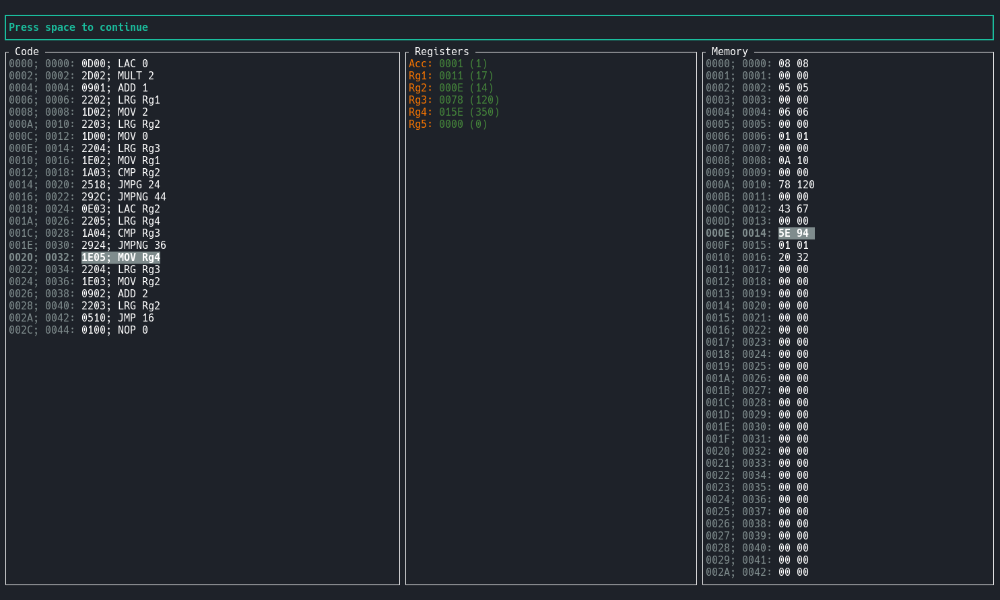

# vm
Эмулятор процессорного ядра

### Запуск:
Компиляция программы генерации виртуальной памяти
```bash
./vm compile init_mem_asm > init_mem
```
Создание образа виртуальной памяти
```bash
./vm dump init_mem mem_dump
```
Компиляция программы
```bash
./vm compile max_v_asm > max_v
```
Запуск программы
```bash
./vm max_v mem_dump
```

